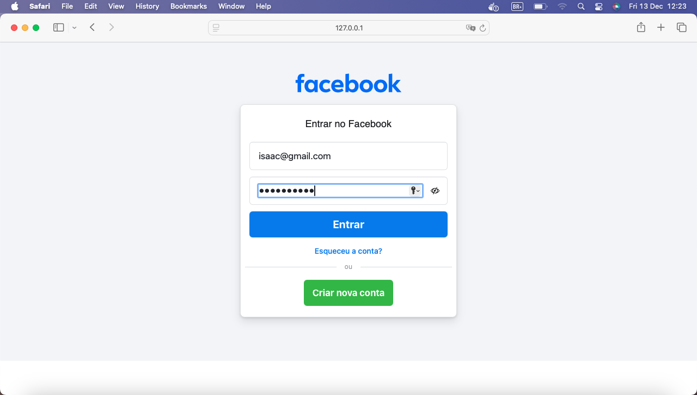
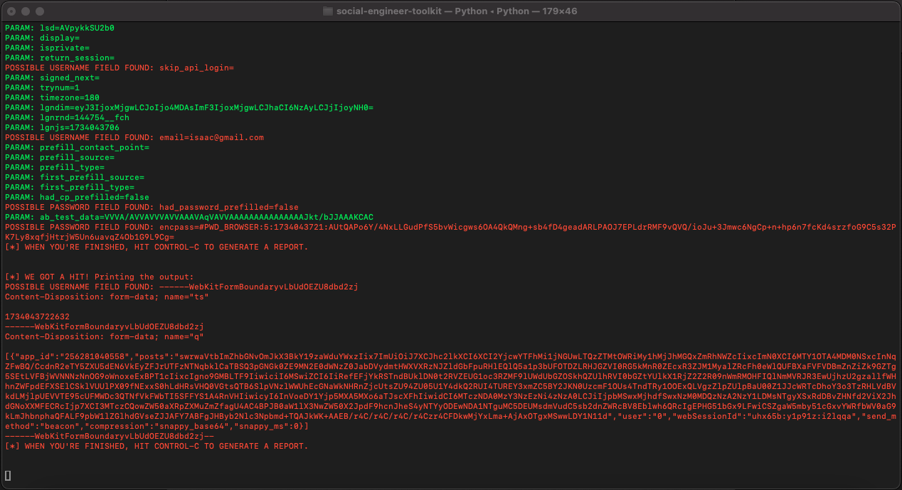

<h1>
    <a href="https://www.dio.me/">
     </a>
    <span> Phishing para captura de senhas do Facebook</span>
</h1>

## Sobre o Projeto
Este repositório contém um tutorial prático para realizar um ataque de **phishing** com o uso do **Kali Linux** e ferramentas associadas. O objetivo do projeto é aprender como funcionam ataques de **engenharia social**, como o phishing, e aplicar o conhecimento adquirido em segurança cibernética de forma ética.
**Aviso importante**: Este projeto deve ser utilizado para fins **educativos** apenas. **Nunca utilize para ataques reais sem permissão explícita**, pois isso é ilegal e antiético.

## Ferramentas
Para realizar esse ataque de phishing, utilizaremos as seguintes ferramentas:

- **Kali Linux**: Sistema operacional voltado para testes de penetração, análise de segurança e hacking ético.
- **Social Engineering Toolkit (SET)**: Ferramenta utilizada para realizar ataques de engenharia social, como phishing, entre outros.

## Configurando o Phishing no Kali Linux

- Acesso root: ``` sudo su ```
- Iniciando o setoolkit: ``` setoolkit ```
- Tipo de ataque: ``` Social-Engineering Attacks ```
- Vetor de ataque: ``` Web Site Attack Vectors ```
- Método de ataque: ```Credential Harvester Attack Method ```
- Método de ataque: ``` Site Cloner ```
- Obtendo o endereço da máquina: ``` ifconfig ```
- URL para clone: http://www.facebook.com

## Resutados




## Tecnologias
<a href="https://www.kali.org/">
    
</a>

<a href="https://github.com/rapid7/metasploit-framework">
    
</a>
